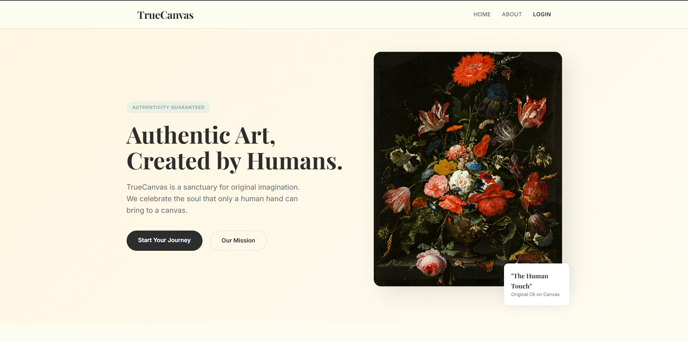

# TrueCanvas 🎨
> **Pure Imagination. No Algorithms.** Our core mission is to showcase ONLY human-drawn art and protect it from algorithmic noise. TrueCanvas is a dedicated sanctuary exclusively for human artists. By identifying and blocking AI-generated uploads, we ensure that every piece of art in your feed is authentically human.


> [!NOTE]
> **Demo Overview**
> 
> *<!-- Visuals -->
<div align="center">
  
</div>

## 🎯 Key Features
- **Vision Transformer (ViT) Gatekeeper**: We custom-trained a Vision Transformer model using PyTorch on a balanced dataset of Human vs. AI-generated art. Running on a dedicated Python server, this gatekeeper checks every artwork, strictly blocking any AI-generated uploads.
- **Artist Autonomy**: Dedicated tools enabling creators to securely login, upload new pieces, update details, or delete their artworks at any time.
- **Authentic User Feed**: A dynamic, premium masonry feed where general users can discover, browse, and engage purely with human-created posts.
- **Full MERN Stack + PyTorch Architecture**: Seamlessly integrates MongoDB, Express.js, React, Node.js alongside an advanced PyTorch deep learning backend.
- **Secure Authentication & Media Delivery**: Features JWT authentication, secure HTTP-only cookies, bcrypt hashing, robust rate-limiting, and automated Cloudinary integration for blazing-fast asset loads.

## 🚀 Quick Start
Get your local environment up and running in 3 simple steps:

**1. Clone & Install Dependencies**
```bash
git clone https://github.com/iftiarrafi/TrueCanvas.git
cd TrueCanvas
npm install --prefix backend && npm install --prefix frontend
```

**2. Configure Environment**
```bash
# Add your environment variables in the backend directory
cd backend
touch .env
```
*(Populate `.env` with the variables listed in the Configuration section below)*

**3. Launch the Application**
```bash
# Start backend, frontend, and AI checker (open 3 separate terminals)
npm run dev --prefix backend
npm start --prefix frontend
python ai_image_checker/app.py 
```

> [!TIP]
> Ensure your MongoDB instance is running, Python is installed for the Flask server, and your Cloudinary credentials are valid before launching the development server.

## ⚙️ Configuration
The application requires the following environment variables. Create a `.env` file in the `backend/` directory:

<<<<<<< HEAD
| Variable | Description | Example / Allowed Values |
|----------|-------------|---------|
| `PORT` | The port the backend server runs on | `3000` |
| `MONGODB_URL` | MongoDB cluster connection URI | `mongodb+srv://...` |
| `JWT_SECRET` | Secret key for robust JWT signing | `your_jwt_secret` |
| `JWT_EXPIRES` | Expiration lifespan for Auth cookies | `1d` |
| `salt` | Hashing complexity for bcrypt | `10` |
| `CLOUDINARY_CLOUD_NAME`| Cloudinary remote cloud identifier | `your_cloud_name` |
| `CLOUDINARY_API_KEY` | Cloudinary REST API key | `123456789012345` |
| `CLOUDINARY_API_SECRET`| Cloudinary REST API secret | `abc123xyz_456def` |
| `EMAIL_USER` | Sender address for Nodemailer | `your@email.com` |
| `EMAIL_PASS` | SMTP app-specific password | `abcd efgh ijkl mnop` |
=======


---


---
>>>>>>> 57a89cdb02e740fe3fc7f999aa11cc9281c76421

## 📄 License
This project is licensed under the MIT License - see the [LICENSE](LICENSE) file for details.
